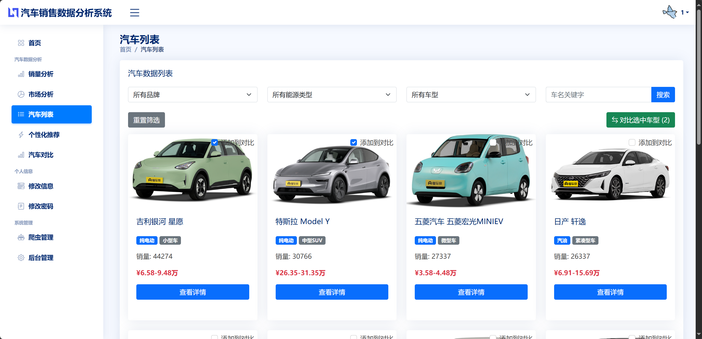
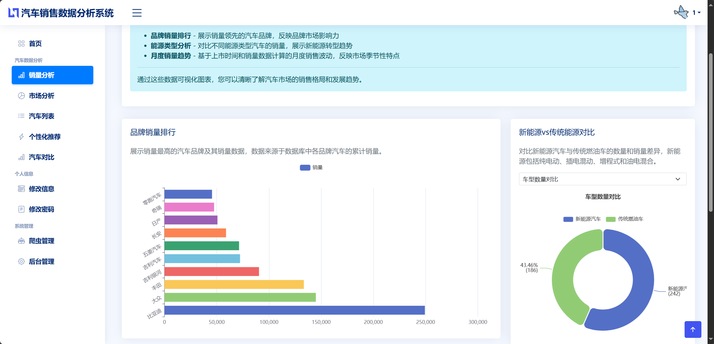
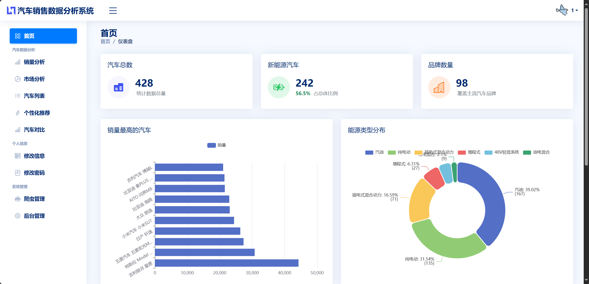
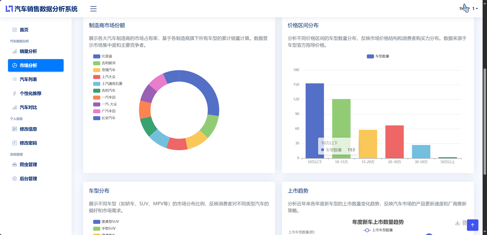
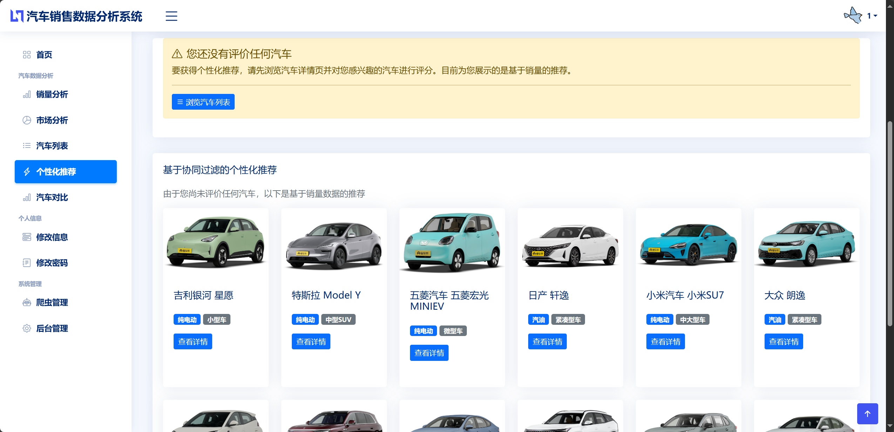
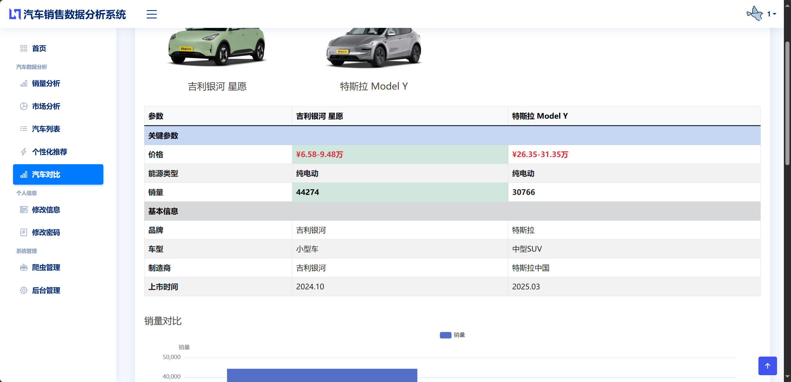
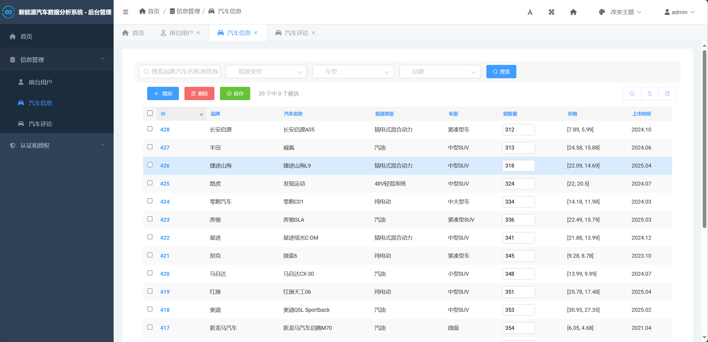

## 计算机毕业设计Django+大模型新能源汽车销量分析可视化 新能源汽车推荐系统 大数据毕业设计(源码+LW+PPT+讲解)


## 要求
### 源码有偿！一套(论文 PPT 源码+sql脚本+教程)

### 
### 加好友前帮忙start一下，并备注汽车销量分析26
### 我的QQ号是 1679232425 或者798059319或者2827724252 或者微信:biyesheji1698 或者 bysj2023nb

# 

### 加qq好友说明（被部分 网友整得心力交瘁）：
    1.加好友务必按照格式备注
    2.避免浪费各自的时间！
    3.当“客服”不容易，repo 主是体面人，不爆粗，性格好，文明人。
## 介绍描述


```
本系统采用Django 3.1.14作为后端框架，MySQL作为数据存储，集成ECharts进行数据可视化，通过网络爬虫技术（基于懂车帝数据源）实现数据自动采集，并运用基于用户的协同过滤算法提供个性化推荐服务。系统实现了汽车数据采集、多维度统计分析、智能推荐、可视化展示等核心功能，为汽车销售市场分析提供了有效的技术解决方案。


系统主要解决的问题包括：
1）汽车销售市场数据的自动化采集与更新；
2）多维度数据分析与可视化展示；
3）基于用户行为的个性化推荐；
4）用户友好的交互界面设计。

总结
本研究成功设计并实现了基于Django的汽车销售量数据分析可视化系统，验证了技术方案的可行性和有效性。系统在数据采集、分析处理、智能推荐、可视化展示等方面都取得了良好的效果，为汽车销售市场分析提供了有价值的工具和方法。

通过系统测试验证，各功能模块运行稳定，性能指标满足实际应用需求。系统不仅具有良好的技术架构和用户体验，还为后续的功能扩展和技术升级奠定了坚实基础。

系统的主要成果包括：

完整的系统架构：采用分层架构设计，实现了表现层、业务逻辑层、数据访问层和数据存储层的有效分离，提高了系统的可维护性和可扩展性。

高效的数据处理：通过网络爬虫技术实现了汽车数据的自动化采集，结合数据清洗和标准化处理，保证了数据的质量和准确性。

智能推荐算法：基于协同过滤算法实现了个性化汽车推荐功能，通过用户评分数据分析，为用户提供精准的推荐服务。

丰富的可视化展示：集成ECharts技术，实现了多种类型的数据可视化图表，包括销量分析、市场分析、趋势分析等。

用户友好的界面：采用Bootstrap框架实现响应式设计，提供良好的用户体验，适配不同设备和屏幕尺寸。


系统详细设计
3.2.1 用户管理模块设计
用户管理模块负责系统的用户认证和权限控制，包括用户注册、登录、个人信息管理等功能。

功能需求分析：

用户注册：新用户可以通过填写用户名、密码等信息进行注册
用户登录：已注册用户可以通过用户名和密码登录系统
个人信息管理：用户可以查看和修改个人信息，包括头像、性别、地址等
密码修改：用户可以修改登录密码
模块结构设计：

用户认证：实现用户登录状态验证和会话管理
数据验证：对用户输入的数据进行有效性验证
安全机制：通过Session机制管理用户状态，中间件验证登录状态
3.2.2 数据采集模块设计
数据采集模块负责通过网络爬虫技术自动获取汽车销售相关数据。

功能需求分析：

网络爬虫：自动从懂车帝网站（dongchedi.com）采集汽车数据
数据清洗：对采集的原始数据进行清洗和标准化处理
数据导入：将清洗后的数据导入数据库
爬虫管理：提供爬虫启动、停止、监控等功能
核心算法设计：

反爬虫处理：通过设置请求头、控制请求频率等方式避免被目标网站封禁
数据提取：使用XPath或CSS选择器提取网页中的结构化数据
数据存储：将提取的数据保存到CSV文件，再导入数据库
3.2.3 数据分析模块设计
数据分析模块负责对系统中的汽车数据进行多维度统计分析。

功能需求分析：

品牌销量分析：统计各品牌汽车的销量排行
车辆类型分析：分析不同车辆类型汽车的市场分布
价格区间分析：统计不同价格区间汽车的数量分布
制造商市场份额：计算各大制造商的市场占有率
接口设计：

数据查询接口：提供统一的数据查询接口，供其他模块调用
统计分析接口：实现各种统计分析算法
结果缓存：对分析结果进行缓存，提升系统性能
3.2.4 推荐算法模块设计
推荐算法模块基于协同过滤算法为用户提供个性化汽车推荐。

功能需求分析：

用户相似度计算：计算用户间的相似度，找出相似用户
推荐生成：基于相似用户的评分数据生成推荐列表
热门推荐：为新用户或评分数据不足的用户提供热门汽车推荐
核心算法设计：

评分矩阵构建：构建用户-汽车评分矩阵
相似度计算：使用余弦相似度计算用户相似度
预测评分：基于相似用户评分预测目标用户对未评分汽车的评分
推荐排序：根据预测评分对推荐结果进行排序
3.2.5 可视化展示模块设计
可视化展示模块负责将分析结果以图表形式展示给用户。

功能需求分析：

图表展示：提供多种类型的图表展示分析结果
交互操作：支持图表的缩放、筛选等交互操作
响应式设计：适配不同屏幕尺寸的设备
接口设计：

图表数据接口：为前端提供图表所需的数据
图表配置接口：支持图表样式和参数的自定义配置
3.2.6 汽车对比模块设计
汽车对比模块允许用户选择多款汽车进行参数对比分析。

功能需求分析：

车型选择：用户可以选择要对比的汽车型号
参数对比：展示所选汽车的关键参数对比
图表分析：以图表形式展示对比结果


随着互联网技术的快速发展和人们生活水平的提高，美食文化日益丰富，用户对个性化美食推荐的需求不断增长。本项目设计并实现了一个基于Python+Django的美食菜谱数据分析推荐系统，旨在通过协同过滤算法和数据可视化技术，为用户提供精准的菜谱推荐服务。

系统采用Django框架作为后端开发平台，MySQL作为数据存储，结合scikit-learn机器学习库实现基于余弦相似度的协同过滤推荐算法。系统主要功能包括用户认证管理、菜品信息浏览、智能推荐、评论评分、多维度数据分析等。通过ECharts可视化技术，系统能够展示菜系分布、评分统计、用户行为分析等多维度数据分析结果。

实验结果表明，该系统能够有效提供个性化菜谱推荐，推荐准确率较高，用户体验良好。系统具有良好的扩展性和实用性，对美食领域的个性化推荐具有重要的参考价值。


 研究目的
本课题的主要研究目的是设计并实现一个智能化的美食菜谱数据分析推荐系统，具体包括：
构建个性化推荐算法：基于协同过滤和余弦相似度算法，实现精准的菜谱个性化推荐
实现多维度数据分析：通过数据挖掘技术，分析用户行为模式、菜系分布、评分趋势等
提供智能决策支持：为用户提供基于数据驱动的菜品选择建议
构建完整Web应用：基于Django框架开发功能完整、用户体验良好的Web系统

 总结
本课题成功设计并实现了一个基于Python+Django的美食菜谱数据分析推荐系统，主要工作成果如下：

主要成果：

系统架构设计：采用Django MTV架构，实现模块化分层设计
推荐算法：实现基于余弦相似度的协同过滤算法
数据分析：实现多维度数据分析和可视化展示
性能优化：实现多层缓存和数据库优化
创新点：

将协同过滤算法与余弦相似度计算相结合
采用模块化设计，形成完整的美食推荐生态系统
设计多层缓存机制和降级策略，解决冷启动问题
6.2 展望
面向未来，系统还可以在以下方面进行改进和完善：

技术发展方向：

深度学习推荐：引入深度学习模型提升推荐精度
多模态推荐：融合文本、图像、视频等多种数据类型
实时推荐：实现基于用户实时行为的动态推荐
可解释推荐：提供推荐理由和解释
功能扩展方向：

移动端应用：开发移动APP，提供更便捷的服务
社交功能：增加用户互动和社区功能
智能助手：集成自然语言处理技术

```


## 运行视频
https://www.bilibili.com/video/BV1JEUwBfEmX

## 运行截图










